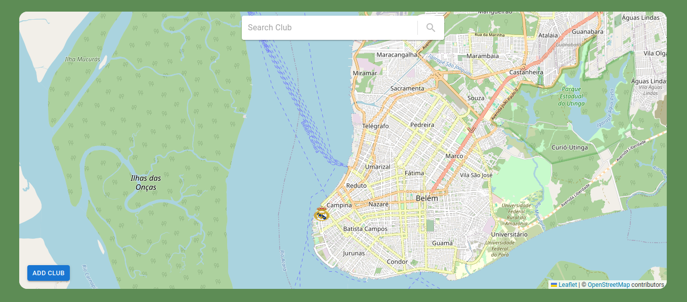

# Aplicação web para registro e localização de clubes de futebol.

    

## Descrição do Projeto

Projeto desenvolvido para a disciplina de Banco de Dados II do curso de Análise e Desenvolvimento de Sistemas do Instituto Federal de Educação, Ciência e Tecnologia da Paraíba Campus Cajazeiras. Trata-se de uma aplicação web desenvolvida para permitir que os usuários registrem, atualizem e excluam clubes de futebol. Além disso, a aplicação oferece a funcionalidade de buscar clubes já cadastrados, exibir sua localização no mapa e acessar informações detalhadas sobre cada clube.

## Status do Projeto

## :man_mechanic: Linguagens e Ferramentas Utilizadas

- `React`
- `Vite`
- `PostgreSQL`
- `HTML`
- `CSS`
- `TypeScript`
- `Vscode`
- `GitGub`
- `Git`
- `Vim`
- `Express`
- `Squelize`
- `Leaffet`

## :hammer: Funcionalidades do projeto

- `Funcionalidade 1`: Registrar um clube de futebol.
- `Funcionalidade 2`: Excluir Clube
- `Funcionalidade 3`: Atualizar as informações de um clube de futebol.
- `Funcionalidade 4`: Buscar clubes já cadastrados na aplicação..
- `Funcionalidade 5`: Visualizar a localização de um clube no mapa.

# :rocket: Instruções para Rodar o Projeto

1. `git clone git@github.com:Bancos-de-Dados-II/projeto-1-bancos-geogr-ficos-teg.git`
2. `cd projeto-1-bancos-geogr-ficos-teg `

### Front end

3. `cd clubmap-webui`
4. `npm i`
5. `npm run dev`

### Back end

6. `cd backend`
7. `npm i`
8. `npm run dev`

## :technologist: Autores

| [ Erick Ribeiro de Sousa](https://github.com/ericksjp) | [ Tasso Moreira de Oliveira](https://github.com/tassomoreira) | [ Gerlândio da Silva Bernardo](https://github.com/GerlandioBernardo) |
| :------------------------------------------------------------------------------------------------------------------------------------: | :--------------------------------------------------------------------------------------------------------------------------------------------------------: | :----------------------------------------------------------------------------------------------------------------------------------------------------------------: |

